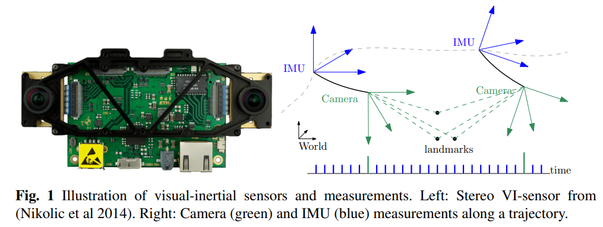
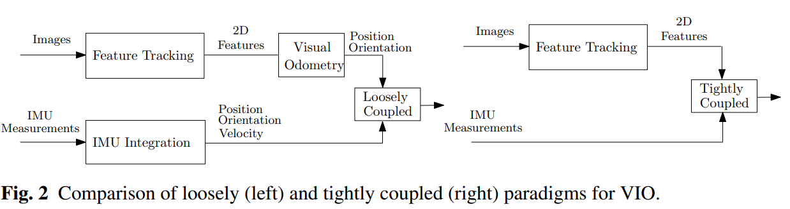

# Visual Inertial Odometry Review

본 글은 ETH-RPG의 Davide Scaramuzza 교수님의 논문을 보고 정리한 글이며, 앞으로 Visual + Inertial 관련 연구를 진행할 계획이기 때문에 Survey paper로 정리를 시작한다.

간단한 정리를 위해서 수식은 최소화한다.

### 용어 및 정의

Visual inertial state estimation은 한개 또는 여러개의 camera와 같은 vision sensor와 역시 한개 또는 여러개의 IMU (Inertial Measurement Units)을 이용하여 로봇의 state (pose and velocity)를 유추하는 문제를 이야기 한다.  간단하게는 Loop  closing 여부에 따라서 VI SLAM, 루프가  없는 경우에는 VIO (Odometry)로 명칭한다.

### 센서적 특성

Camera와 IMU는 다른 인식  센서에 비해 가격이 매우 합리적이기 때문에 소형 또는 상용화 로봇에서 많이 사용하는 조합이다. 또한 센서적 특성도 서로 상보적이기 때문에 위치 인식 상용화에 가장 가깝다고 이야기 할 수 있다.

Camera는 camera sensor에 들어오는 빛을 일정시간동안 취득하여 외부환경을 rich하게 획득하는 센서라고 하면, IMU는 반대로 비교적 외부환경에 대한 영향없이 센서에 가해지는 움직임 (즉, 스스로의 모션)을 검출하는 특성을 가지고 있다. 이러한 센서적 특성으로 인해 카메라는 저속의 움직임에서 비교적 정확한 모션을 검출하는데 유리하나 조명, 속도 등에 큰 영향을 받으며 반대로 IMU는 빠른 모션을 검출할 수 있으나, 미소한 모션에 대해서는 bias나 noise로 인해서 계속 drift가 누적되는 문제가 발생한다. 이러한 상보적인 센서들을 잘 융합하면 최소한의 조합으로 정확하고 정밀한 모션 검출이 가능하다.

<!--  -->

보통 위 그림처럼 센서가 구성되는데, IMU는 1000Hz에 가까운 속도로 연속적인 데이터를 제공하며, 카메라는 일반적으로 100 Hz미만의 속도로 데이터를 제공한다. 대신 카메라는 외부 환경 정보를 취득할 수 있다.

### 센서 정보 융합

서로 다른 두 센서를 어떻게 융합하는 지에 따라서 Loosely coupled와 Tightly coupled로 융합 방법을 구분할 수 있다. 간단히 설명하면 아래와 같다

- Loosely Coupled: 각 센서에서 독립적으로 모션을 추출하고 (카메라: Position, Orientation / IMU: Position, Orientation, Velocity) 추출된 모션을 상보적으로 융합
- Tightly Coupled: 각 센서의 Raw data를 융합하여 사용. 예를 들면 Camera에서 feature tracking을 할 때 IMU에서 나온 모션을 Initial로 하여 feature를 검출하는 방법

논문에서도 설명하기로는 Loosely coupled 보단 Tightly coupled 방법이 좀 더 높은 정확도를 가진다고 설명한다. 직관적으로 생각해도 그럴 것이, loosely coupled의 경우에는 각 센서가 독립적으로 모션을 추출하기 때문에 원래 센서가 가지고 있던 한계 (drift 등)가 fusion 시에도 남아있게 된다. 즉, 모션 ambiguity에 대해 근본적인 보상이 어렵다.

### Visual Inertial Odometry의 3가지 방법론

다양한 Visual Odometry는 **Filtering, Fixed-lag Smoothers, Full smoothers** 로 분류할 수 있다.

- Filterting
    - 현재 state (pose,  velocity)와 global landmark만 estimate. 하지만 속도 문제로 대부분 현재 camera state만 estimate 하는 방법이 대부분
    - 장: 빠르다. 연산이 효율적
    - 단: 이전 state는 해당 시점에 linearization하고 버려버리기 때문에 이전에 state error가 그대로 현재 state에 남아있는 경우가 많다. 그리고 이전 state 정보를 버리기 때문에 IMU가 취약한 데이터 Global position과 yaw에 대해서는 에러가 계속 누적되는 문제가 발생 → *First-estimate jacobian을 사용해서 해결하려는 시도*
- Fixed-lag Smoother
    - Local time window를 현재로 부터 과거 동안의 일정 크기의 state를 최적화 하는 방법.
    - 장: 이전 state를 일정 시간동안 유지하기 때문에 filtering 보다 더 정확
    - 단: 하지만 역시 inconsistency와 linearization error에서 자유롭지 못하다.
- Full smoother
    - 이전의 모든 state를 정보를 기억하면서 대규모의 nonlinear optimization 문제를 해결하는 방법 (GTSAM의 IMU preintegration 방법이 여기에 속함)
    - 장: 이전 state를 가지고 있기 때문에 가장 정확한 방법
    - 단: 우선 state가 많아질수록 complexity가 계속 높아진다는 문제가 발생
      - Fixed-lag와 비슷한 framework으로 Keyframe을 도입하든가
      - Multi-thread를 이용해서 tracking과 mapping을 병렬적으로 수행한다.

기본적으로 두 센서를 함께 사용할 때, IMU가 카메라에 비해 매우 빠르기 때문에 Filtering의 경우 대부분 IMU를 processing model로, Camera를 measurement model로서 사용한다. 반면 Smoothing 방법은 window 또는 graph구조를 지니기 때문에 두 카메라의 measurement 사이의 imu data들을 누적하는 integration 방법이 필요하다 ([Imu preintegration](http://www.roboticsproceedings.org/rss11/p06.pdf))
